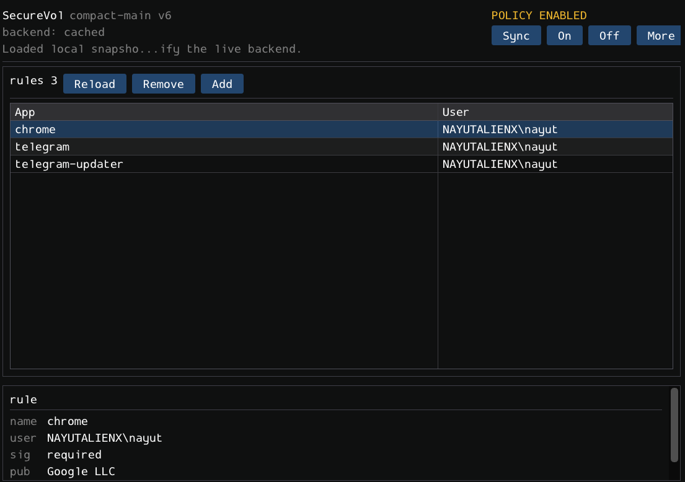

# SecureVol

SecureVol is a defensive local-only Windows project that restricts read/write access to a mounted VeraCrypt volume by combining:

- a Windows Filter Manager minifilter driver scoped to one configured volume,
- a .NET 8 Windows service that performs process identity verification,
- a small admin CLI for policy management, state inspection, and dedicated-user launches,
- a shared app-core library for desktop control paths,
- a WPF desktop manager, a transitional managed ImGui shell, and a new native upstream Dear ImGui shell for user-facing operations,
- an installer/bootstrapper engine that installs the packaged backend, driver payload, and admin UI from a release bundle.

The repository is intentionally conservative:

- protection is deny-by-default only for the configured protected volume,
- the driver stays small and asks user mode for first-seen process decisions,
- complex identity checks stay in user mode,
- the minifilter stays demand-start, while the backend can optionally auto-start after Windows boots and load the filter outside the boot-critical path.

See `docs/` for threat model, build/install steps, recovery, and testing guidance.
See `docs/product-backlog.md` for the productization roadmap.

## Administrator Requirement

SecureVol manages a Windows service, a Filter Manager minifilter driver, protected policy files under `C:\ProgramData`, and scheduled tasks. Run the installer, repair/update actions, and the native admin UI as Administrator. The GUI installer and native admin app request elevation, but if Windows blocks UAC elevation the operation should be considered failed.

## Current UI

The current admin surface is a native Win32/DX11 shell built on upstream [`ocornut/imgui`](https://github.com/ocornut/imgui).



## Installer artifact

The repository now produces a packaged Windows install bundle that contains:

- the minifilter driver package,
- the SecureVol Windows service,
- the CLI,
- the native Dear ImGui admin app,
- the setup host used for install, repair, and uninstall,
- a GUI installer bootstrapper for new machines, including a GitHub updater that downloads the latest release asset and launches repair from it.

Important for the current preview:

- the bundled driver is still test-signed,
- a new machine currently needs Windows test-signing mode enabled,
- installation must be run as Administrator; the GUI installer requests elevation,
- if test-signing was just enabled, Windows must be rebooted and the installer run again.
- repair/update installs backend payloads into versioned directories under `C:\Program Files\SecureVol\payloads`, so a running old service cannot block copying the new release.
- the installer can configure the SecureVol backend to start with Windows through both an automatic service and a visible `\SecureVol\StartBackend` scheduled task; the backend then loads the minifilter and reapplies the saved policy automatically.
- `Update from GitHub` in the installer checks the public `nayutalienx/securevol-windows` releases API, downloads the newest `SecureVol.Installer-win-x64-*.zip` asset, extracts it, and starts the downloaded installer in automatic `repair` mode.
- after install/repair, the GUI installer is persisted to `C:\Program Files\SecureVol\installer\SecureVol.Installer.exe`; the native admin UI has a `Update` button that launches that installer in GitHub update mode.

## Quick install on a new machine

1. Download and extract the latest `SecureVol.Installer-*.zip` package.
2. Run `SecureVol.Installer.exe` as Administrator.
3. Click `Install` in the installer window.
4. Reboot if the installer enables test-signing.
5. Run `SecureVol.Installer.exe` again after reboot if prompted.
6. Launch the admin app from the installer or the Start Menu shortcut.

## Updating

Run the newer `SecureVol.Installer.exe` as Administrator and click `Repair`. The installer writes a fresh payload directory, points the Windows service at the new backend path, updates shortcuts, and only then tries to clean old payloads. If Windows still has the old backend loaded, cleanup is skipped and the installer reports `RebootRequired: True` instead of failing.

For later updates, launch `SecureVol Installer` from the Start Menu or click `Update` in the native admin UI. This starts the persistent installer from `C:\Program Files\SecureVol\installer`, downloads the latest GitHub artifact, verifies its SHA-256 checksum from the release notes, and runs repair from the downloaded version.

## One-click diagnostics

For broken installs or "policy enabled but not blocking" cases, do not copy logs manually. Run the installer or native admin UI as Administrator and click `Upload Diagnostics` / `Diag`. SecureVol creates a plain-text diagnostic report, uploads it to a public paste endpoint, opens the URL, and keeps a local copy under `C:\ProgramData\SecureVol\diagnostics`.

The same path is available from CLI:

```powershell
securevol diagnostics upload --open
```

The uploaded report can include local paths, Windows user names, configured allow rules, volume IDs, service/driver state, `fltmc` output, and recent SecureVol logs. Use it only when you intend to share that diagnostic state.

## Startup And Remount Behavior

When the installer option `Start SecureVol backend automatically with Windows` is enabled, `SecureVolSvc` is configured as an automatic Windows service and the installer also creates a visible `\SecureVol\StartBackend` scheduled task that runs `sc.exe start SecureVolSvc` at system startup. The service loads `SecureVolFlt`, explicitly attaches the minifilter to the configured mounted drive when protection is enabled, pushes the saved policy to the driver, and keeps watching the configured mount point such as `A:\`. If the VeraCrypt container is mounted after Windows starts, the service resolves the current volume GUID for that mount point and updates the driver policy without requiring repair. The native admin `On` and drive `Apply` actions also resolve the current drive letter locally before writing policy, so they do not depend on a live backend pipe just to bind `A:` to the correct volume GUID.

## Project status

SecureVol is already usable as a local defensive tool, but it is still in productization:

- the minifilter, service, CLI, and current desktop manager work locally,
- the packaged installer path now has a real GUI bootstrapper plus the underlying install engine,
- the native `ocornut/imgui` desktop shell is the primary admin UI,
- a polished public installer wrapper and a production-signed driver are still pending,
- open-source hygiene and release automation are now part of the repo instead of ad hoc local setup.

## Open-source expectations

- No stealth, persistence tricks, privilege escalation, or security-product tampering will be accepted.
- Recovery must remain obvious and documented.
- Degraded backend states must never be shown as a healthy protected state.

## Repository guide

- `driver/`: minifilter driver
- `service/`: Windows service and policy coordinator
- `cli/`: admin CLI and launch helper
- `app/`: desktop control surfaces
- `app/SecureVol.AppCore`: shared desktop control-path logic
- `app/SecureVol.App`: current WPF manager
- `app/SecureVol.ImGui`: transitional managed shell based on `ImGui.NET`
- `app/SecureVol.ImGuiNative`: native shell built on official upstream `ocornut/imgui`
- `installer/`: setup host and install/bootstrap work
- `common/`: shared protocol, interop, policy, logging
- `scripts/`: local build, install, release, and artifact packaging utilities
- `docs/`: threat model, testing, hardening, product backlog, and release notes

## Building

- Managed projects: `dotnet build`
- Tests: `dotnet test`
- Driver: Visual Studio 2022 + latest WDK
- Full packaged installer artifact: `powershell -ExecutionPolicy Bypass -File .\scripts\Build-Installer-Artifact.ps1`

The GitHub Actions workflow currently validates only the managed projects. The driver still needs a dedicated WDK-capable Windows build environment.
